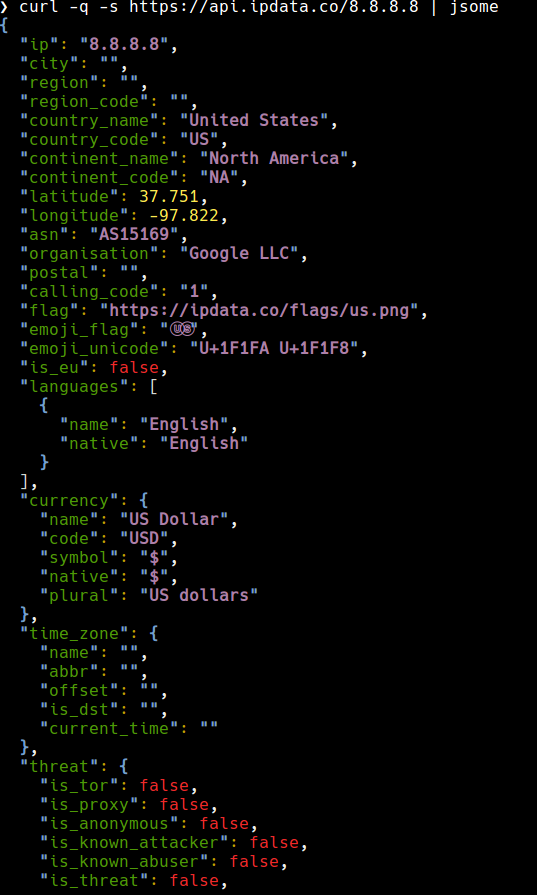

# jsome
[](https://github.com/jakewarren/jsome/actions)
[](https://github.com/jakewarren/jsome/releases])
[](https://github.com/jakewarren/jsome/blob/master/LICENSE)
[](https://goreportcard.com/report/github.com/jakewarren/jsome)
[](http://makeapullrequest.com)
> cli utility for colorizing your JSON


## Install
### Option 1: Binary

Download the latest release from [https://github.com/jakewarren/jsome/releases/latest](https://github.com/jakewarren/jsome/releases/latest)

### Option 2: From source

```
go get github.com/jakewarren/jsome
```

## Screenshot



## Usage

```
Usage: jsome [<flags>] [FILE]

Example:
	jsome file.json
	cat file.json | jsome 

Optional flags:

  -h, --help   display help

```

## Acknowledgements

[Javascipt/Jsome](https://github.com/Javascipt/Jsome) - for inspiration of the tool, and for the name I shamelessly copied  
[nwidger/jsoncolor](https://github.com/nwidger/jsoncolor) - awesome library that powers this tool

## Changes

All notable changes to this project will be documented in the [changelog].

The format is based on [Keep a Changelog](http://keepachangelog.com/) and this project adheres to [Semantic Versioning](http://semver.org/).

## License

MIT © 2018 Jake Warren

[changelog]: https://github.com/jakewarren/jsome/blob/master/CHANGELOG.md
